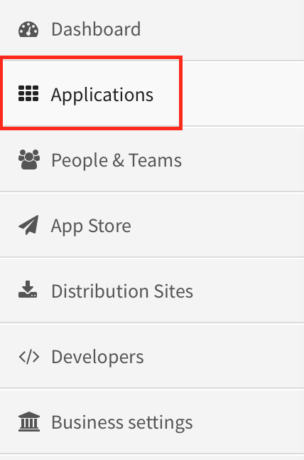
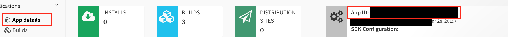
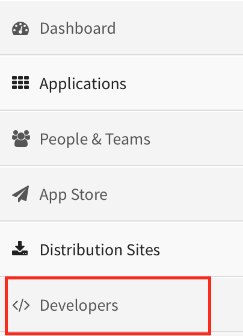
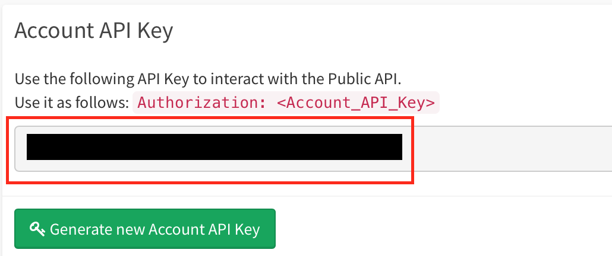

# AppliveryControl
Created by Yaroslav Nevmerzhytskyi

# Known issues:
* Terminal window needs to be closed and reopened after initial setup.
* Build Uploading is currently commented out.
* One Application and one user is currently supported.

# How to install
1. Change mode of the file if needed
`sudo chmod +x appliveryControl.sh`
2. Run the file
`./appliveryControl.sh`
3. Open Applivery in your browser for initial setup.
4. Go to 'Applications', select application and copy 'App ID' value from 'App details'.

5. Paste to Terminal when requested.
6. Go to 'Developers' and copy 'Account API Key'.

7. Paste to Terminal when requested.
8. If you wasn't requested to re-enter App ID everything went well.
9. Close Terminal window and open a new one.
